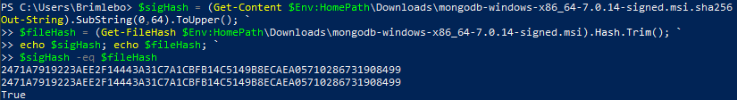
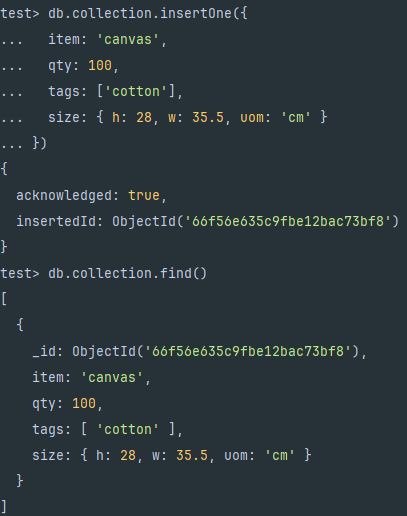
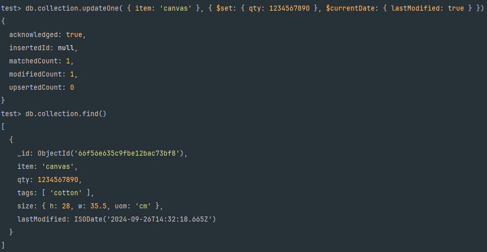
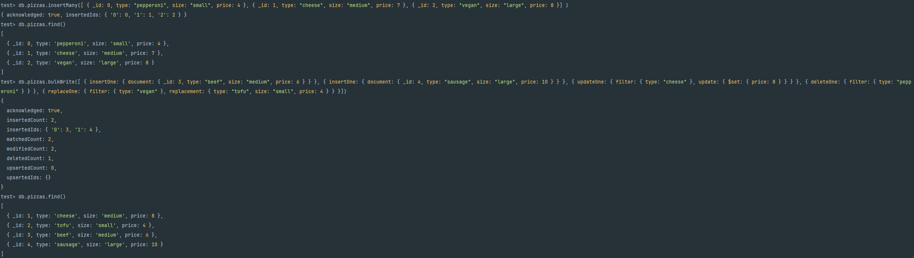
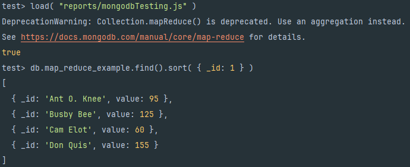
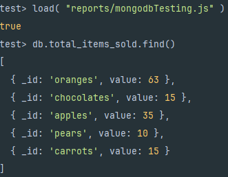

# DAT250 Experiment Assignment 5 - report

Only issue I've stumbled upon with this experiment is not being able to easily find version 4.4, so I ended up using 7.0.14 while working on this.

## Screenshots:

### Package verification:

### Experiment 1:
#### Insert and query

#### Update

#### Bulk operations on pizzas (Including deleteOne() and replaceOne())

### experiment 2:

I made a javascript file to do the mapReduction from the tutorial, the following is the result of using it.  
[mapReduce file](../exp5/mongodbTesting.js)  

I added another map-reduce operation to the same file that aims to count the number of each item that have been sold, you can see the result below.  
  
This can be useful in finding what items are the most popular with customers, this can allow the business to make data-driven decisions about how to best manage their inventory of items.
